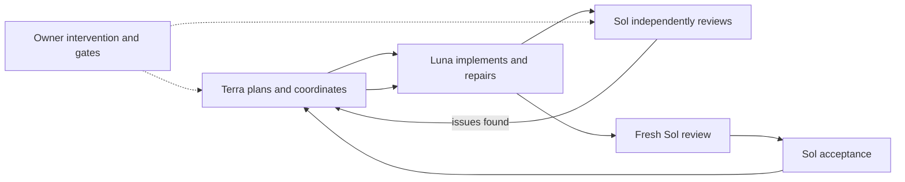

# Tri-Tier Agent System

[](https://github.com/strider308/tri-tier-agent-system/actions/workflows/powershell.yml) [](LICENSE) [](https://github.com/strider308/tri-tier-agent-system/releases)

Evidence-driven orchestration for coding agents. Tri-Tier separates planning and coordination, implementation and repair, and independent review across Terra, Luna, and Sol, with durable state, risk/evidence gates, recovery, and explicit owner control.

## Status

**Technical Alpha — not production-ready.** The current recommended public release is **`v0.1.1-alpha`**. Its CLI reports **`0.10.0-alpha`**; the repository release and CLI use separate version identifiers.

The project is currently validated primarily on Windows with PowerShell 7, Git, and a compatible coding-agent harness. The harness supplies the actual agent dispatch/execution integration; Tri-Tier supplies the CLI, profiles, routing, durable state, evidence, and review lifecycle.

## Terra, Luna, and Sol

- **Terra** is the manager/coordinator: it plans, decomposes work, tracks dependencies, owns durable coordination state, and determines continuation.
- **Luna** is the implementation/repair worker: it investigates, implements bounded changes, tests, repairs findings, and produces implementation evidence.
- **Sol** is the independent reviewer/adjudicator: it reviews architecture, risk, security, and acceptance evidence, creates findings, performs fresh reviews, and adjudicates higher-risk work.

The implementing role does not independently approve its own work.



## Why Tri-Tier?

One agent that plans, implements, and approves its own work can miss weak evidence, ambiguous authority, context loss, endless repair loops, or dangerous actions that should stop for an owner. Tri-Tier makes those boundaries explicit: durable state reconstructs progress, evidence and risk gates constrain advancement, independent review challenges the work, and owner gates stop high-impact decisions.

## Five-minute safe start

Pin the tested alpha release for repeatable onboarding:

```powershell
git clone https://github.com/strider308/tri-tier-agent-system.git
Set-Location .\tri-tier-agent-system
git checkout v0.1.1-alpha

pwsh -NoProfile -File .\src\tri-agent.ps1 version
pwsh -NoProfile -File .\src\tri-agent.ps1 doctor

$TriTierRoot = Join-Path $env:LOCALAPPDATA 'TriTierAgentSystem\isolated'
pwsh -NoProfile -File .\src\tri-agent.ps1 compatibility-check -InstallRoot $TriTierRoot -Json
pwsh -NoProfile -File .\src\tri-agent.ps1 install-plan -InstallRoot $TriTierRoot -Json
pwsh -NoProfile -File .\src\tri-agent.ps1 install-apply `
    -InstallRoot $TriTierRoot `
    -ConfirmInstallRoot $TriTierRoot `
    -Json
pwsh -NoProfile -File .\src\tri-agent.ps1 install-status -InstallRoot $TriTierRoot -Json

# Safe first command from any working directory:
& "$TriTierRoot\bin\tri-agent.ps1" classify `
    -Prompt 'Document a low-risk feature' -Json
```

Checking out the tag intentionally pins this alpha to a known runtime. Planning is read-only; applying requires the exact target confirmation. The isolated installation does not modify `PATH`, `$HOME\.codex`, or `CODEX_HOME`.

See the [five-minute quickstart](docs/quickstart.md) and [installation guide](docs/installation.md) for uninstall and recovery steps.

## What Tri-Tier is not

Tri-Tier is not a deployment platform, certification system, guarantee of correct code, replacement for human ownership, or automatic production deployment system. It is not designed to silently replace an existing private Codex setup and is not currently production-ready. Review generated changes and high-impact decisions yourself.

## Public documentation

- [Quickstart](docs/quickstart.md)
- [Installation](docs/installation.md)
- [Recovery](docs/recovery.md)
- [Migration](docs/migration.md)
- [Command reference](docs/command-reference.md)
- [Architecture](docs/architecture.md)
- [Runnable examples](examples/README.md)
- [Current release notes](docs/release-v0.1.1-alpha.md)
- [Historical v0.1.0-alpha release notes](docs/release-v0.1.0-alpha.md)
- [Contributor workflow](docs/contributor-workflow.md)
- [Contributing](CONTRIBUTING.md)
- [Security policy](SECURITY.md)
- [Support](SUPPORT.md)

Public validation covers deterministic evidence resolution, isolated installation, recovery and migration health, durable state, restart/resume, finding/repair/fresh-review, and owner gating. These are validation results, not safety guarantees.

<!-- BEGIN TRI-TIER PUBLIC DOCS -->
The public command reference is mechanically checked against the live CLI command cases.
<!-- END TRI-TIER PUBLIC DOCS -->

## License

Licensed under the Apache License, Version 2.0. See [LICENSE](LICENSE) and [NOTICE](NOTICE).
